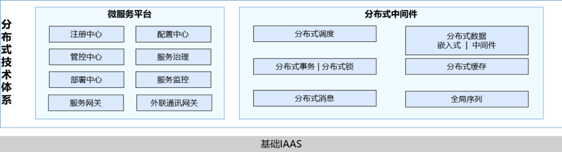

## 培训规划
本次新建分布式体系包括如两大部分，微服务平台与分布式组件。其中微服务平台是整体结合的技术栈，分布式组件是独立组件，可脱离微服务使用

分布式体系基于开源产品构建，学习路线为从开源使用到平台使用。培训计划先从微服务平台开始，之后结合微服务培训分布式组件。

### 初步计划
1. 微服务培训
2. 分布式组件 - 分布式消息（消息队列）
3. 分布式数据（分库分表） 
4. 全局序列（分布式ID） 
5. 分布式事务 
6. 分布式调度 
7. 分布式锁

## 怎么学
学习认知遵从3M认知模型
- What: 是什么，例如消息队列的概念
- How: 怎么做，例如动手做简单的消息队列demo，每节培训提供操作指引，建议大家本地动手实践
- Why：为什么需要消息队列，理解应用场景，进一步理解基本原理