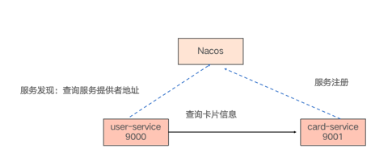
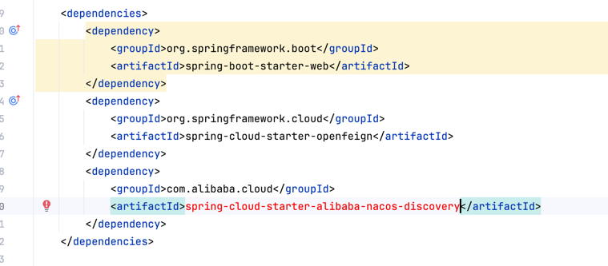
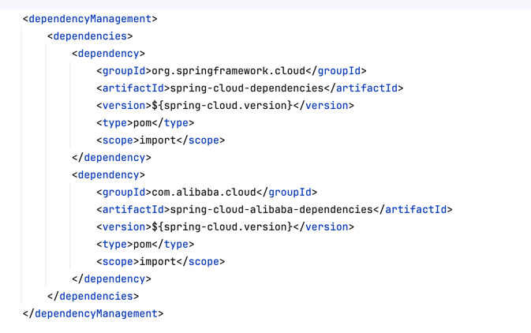
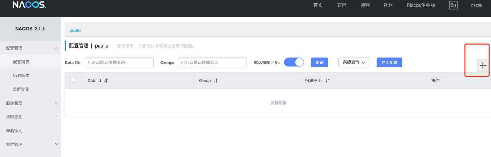
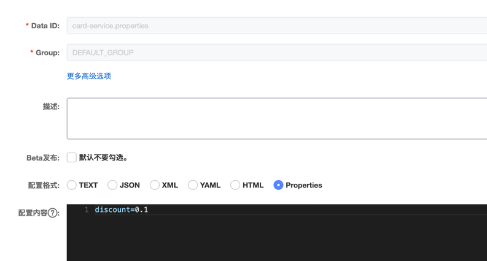

## 01-服务发现
### 01-01概念
#### 服务发现是什么？
客户端通过查询服务注册中心，获取可用的服务的实际网络地址（IP Address 和 端口号）来选择一个可用的服务实例，并将请求发送至该服务。

#### 注册中心是什么
注册中心用来集中管理微服务，解决注册、维护和发现三大功能问题
- 服务的注册： 当服务启动的时候，它应该通过某些形式注册到注册中心上
- 服务的维护： 保证所维护的服务列表的正确性
- 服务的发现：消费者依靠服务发现框架，将一个符号（比如 Eureka 中的 ServiceID、Nacos 中的服务名、或者通用的FDQN）转换为服务实际

#### 为什么需要注册中心
微服务之前有大量跨进程远程调用，注册中心是当前解决方案，其他方案：
- DNS：难以维护，服务变更后通知慢
- 容器网络：kubernetes默认提供了服务发现能力，但不支持服务配置、熔断、限流，相对功能受限
- SOA：传统解决方案，非开源，功能完善强大，但扩展性受限

#### 注册中心有哪些选型
常用的有
- Eureka：最早netflix开源的注册中心，应用最广泛
- Consul：相对Eureka支持服务配置，功能与性能更强大，应用比较广泛
- Nacos：阿里开源的注册中心，也支持服务配置，国内用的比较多，符合信创要求

#### Nacos是什么？
Nacos是阿里开源的注册中心，支持服务发现与配置，架构上包括两部分
- Nacos服务端：负责服务注册信息与配置信息的维护，可依赖独立数据库实现数据持久化与高可用
- SDK客户端：阿里基于springcloud扩展了springcloudalibaba，基于springcloud体系对接nacos服务端

### 01-02使用
#### 本地搭建nacos
前提安装好docker，使用docker快速启动，windows打开cmd，mac使用terminal，运行命令
```
docker pull nacos/nacos-server:v2.1.1
docker run --name nacos-quick -e MODE=standalone -p 8848:8848 -p 9848:9848 -p 9849:9849 -d nacos/nacos-server:v2.1.1
```
启动后打开地址`http://localhost:8848/nacos/#/login`， 默认用户名nacos,密码nacos。使用手册参考https://nacos.io/docs/latest/guide/admin/console-guide/。
服务管理业务展示当前注册服务，核心概念包括
- 服务：微服务
- 实例：微服务进程
- 保护阈值：保护阈值=（实际健康实例/总服务实例）≤设置的保护阈值。如果低于保护阈值，则将全部实例：健康实例 + 非健康实例全部返回给调用者，防止剩余实例被压垮
- 命名空间：不同的命名空间下，配置数据以及注册的服务数据隔离，用于实现不同环境数据隔离，如开发与测试环境分别建立两个命名空间，实现逻辑隔离。Nacos 中存在一个默认的命名空间 public，所有配置以及服务注册，在没有指定命名空间时都会默认从 public 这个命名空间拉取配置以及注册到该命名空间下的注册表中。

#### 本地应用集成springcloudalibaba对接nacos
集成后效果如下


改造user-service与card-service，在两个工程的pom.xml分别引入依赖，首先在pom.xml文件的dependencies标签下添加如下依赖
```
<dependency>
    <groupId>com.alibaba.cloud</groupId>
    <artifactId>spring-cloud-starter-alibaba-nacos-discovery</artifactId>
</dependency>
<dependency>
    <groupId>org.springframework.cloud</groupId>
    <artifactId>spring-cloud-starter-loadbalancer</artifactId>
</dependency>
```


在pom.xml文件的dependencyManagement标签下的dependencies标签下添加如下依赖，引入springcloudalibaba包管理
```
 <dependency>
    <groupId>com.alibaba.cloud</groupId>
    <artifactId>spring-cloud-alibaba-dependencies</artifactId>
    <version>${spring-cloud-alibaba.version}</version>
    <type>pom</type>
    <scope>import</scope>
</dependency>
```


在user-service的bootstrap.yml文件添加如下配置(直接替换)
```
spring:
  application:
    name: user-service
  cloud:
    nacos:
      discovery:
        server-addr: 127.0.0.1:8848
        namespace: public
```
在user-service的UserApplication类的添加注解@EnableDiscoveryClient
```
package com.demo;

import org.springframework.boot.SpringApplication;
import org.springframework.boot.autoconfigure.SpringBootApplication;
import org.springframework.cloud.client.discovery.EnableDiscoveryClient;
import org.springframework.cloud.openfeign.EnableFeignClients;

@EnableFeignClients
@EnableDiscoveryClient
@SpringBootApplication
public class UserApplication {

    public static void main(String[] args) {
        SpringApplication.run(UserApplication.class, args);
    }
}
```
在card-service的bootstrap.yml文件添加如下配置(直接替换)
```
spring:
  application:
    name: card-service
  cloud:
    nacos:
      discovery:
        server-addr: 127.0.0.1:8848
        namespace: public
```
在card-service的CardApplication类的添加注解@EnableDiscoveryClient
```
package com.demo;

import org.springframework.boot.SpringApplication;
import org.springframework.boot.autoconfigure.SpringBootApplication;
import org.springframework.cloud.client.discovery.EnableDiscoveryClient;

@EnableDiscoveryClient
@SpringBootApplication
public class CardApplication {

    public static void main(String[] args) {
        SpringApplication.run(CardApplication.class, args);
    }

}
```
修改user-service的webclient，删掉@FeignClient中的固定url，改为动态服务发现机制
```
package com.demo.webclient;

import com.demo.model.Card;
import org.springframework.cloud.openfeign.FeignClient;
import org.springframework.web.bind.annotation.GetMapping;
import org.springframework.web.bind.annotation.PathVariable;

@FeignClient(name = "card-service")
public interface CardClient {

    @GetMapping("/cards/{cardNo}")
    Card getCardByCardNo(@PathVariable("cardNo") Long cardNo);
}
```

启动两个服务，打开nacos页面http://localhost:8848/nacos/#/serviceManagement?dataId=&group=&appName=&namespace=&namespaceShowName=public,可以看到两个服务都已经注册。

调用api http://localhost:9000/users/1  发起一次服务调用，看到结果返回正常，微服务之间正常通信

### 01-03基本原理
服务注册原理： 应用在启动的时候，springcloudalibaba组件会携带自身信息调用nacos服务注册api发起请求，请求参数如下
```
POST /nacos/v1/ns/instance
{ip='192.168.222.96', port=9001, weight=1.0, healthy=true, enabled=true, ephemeral=true, clusterName='DEFAULT', serviceName='null', metadata={IPv6=[2409:8970:3a5a:13ee:9968:8cc5:469f:b0e7], preserved.register.source=SPRING_CLOUD}}
```

服务发现原理：应用在httpclient调用时，解析服务名会被springcloudalibaba组件拦截，此时调用nacos api查询服务列表，请求参数如下
```
GET /nacos/v1/ns/instance/list?serviceName=card-service
```
示例返回如下
```
{
  "name": "DEFAULT_GROUP@@nacos.test.1", 
  "groupName": "DEFAULT_GROUP", 
  "clusters": "", 
  "cacheMillis": 10000, 
  "hosts": [
    {
      "instanceId": "10.10.10.10#8888#DEFAULT#DEFAULT_GROUP@@nacos.test.1", 
      "ip": "10.10.10.10", 
      "port": 8888, 
      "weight": 1, 
      "healthy": false, 
      "enabled": true, 
      "ephemeral": false, 
      "clusterName": "DEFAULT", 
      "serviceName": "card-service", 
      "metadata": { }, 
      "instanceHeartBeatInterval": 5000, 
      "instanceIdGenerator": "simple", 
      "instanceHeartBeatTimeOut": 15000, 
      "ipDeleteTimeout": 30000
    }
  ], 
  "lastRefTime": 1528787794594, 
  "checksum": "", 
  "allIPs": false, 
  "reachProtectionThreshold": false, 
  "valid": true
}
```

服务维护原理：应用在启动后，springcloudalibaba组件会启动定时任务发送心跳，周期默认是 5 秒，Nacos 服务端会在 15 秒没收到心跳后将实例设置为不健康，在30秒没收到心跳时将这个实例摘除

## 02-服务配置

### 02-01 概念

#### 为什么需要服务配置
在没有「配置中心」的传统项目中，处理配置有如下问题
1. 配置都保存在代码库的静态配置文件中，一但配置变更需要提交修改，发布新包，重新部署，流程长
2. 配置修改难以追溯，配置与应用代码在一个库里，配置修改与代码修改混杂
3. 项目可能会有多个环境，例如：测试环境、预发布环境、生产环境。每一个环境所使用的配置参数理论上都是不同的，所以我们在配置文件中根据不同环境配置不同的参数。这些都是手动维护，在项目发布的时候，极其容易因开发人员的失误导致出错

#### 什么是配置中心
「配置中心」的思路就是分离配置与应用，将配置全部都放到一个集中的地方进行统一管理，并提供一套标准的接口。
-  当各个服务需要获取配置的时候，请求「配置中心」拉取数据。
- 可以在「配置中心」中更新配置，并记录版本。
- 「配置中心」更新时能实时通知到各个服务，使应用配置数据动态更新

#### Nacos配置中心
Nacos不仅可以作为注册中心使用，还可以作为配置中心使用。Nacos配置中心有三个概念

- dataid：用做配置分组，一个系统或者应用可以包含多个配置集，例如数据库配置集、业务配置集等
- 命名空间(namespace): 不同命名空间数据隔离，一般用于实现配置分组。

### 02-02 使用
需求：card-service新增一个配置discount，支持不重启应用使修改生效

改造card-service，在工程的pom.xml引入依赖，pom.xml文件的dependencies标签下添加如下依赖
```
<dependency>
    <groupId>com.alibaba.cloud</groupId>
    <artifactId>spring-cloud-starter-alibaba-nacos-config</artifactId>
</dependency>
```
在card-service的bootstrap.yml文件添加如下配置中心配置(直接替换原先spring配置模块)
```
spring:
  application:
    name: card-service
  cloud:
    nacos:
      discovery:
        server-addr: 127.0.0.1:8848
        namespace: public
      # 新增配置中心地址
      config:
        server-addr: 127.0.0.1:8848
```
在card-service的CardController填写如下代码
```
package com.demo.controller;

import com.demo.model.Card;
import com.demo.service.CardService;
import org.slf4j.Logger;
import org.slf4j.LoggerFactory;
import org.springframework.beans.factory.annotation.Value;
import org.springframework.cloud.context.config.annotation.RefreshScope;
import org.springframework.web.bind.annotation.GetMapping;
import org.springframework.web.bind.annotation.PathVariable;
import org.springframework.web.bind.annotation.RestController;

// RefreshScope注解实现动态刷新
@RefreshScope
@RestController
public class CardController {

    // @Value标明discount为配置项
    @Value(value = "${discount:1.0}")
    private String discount;

    // 新增查询接口
    @GetMapping("/cards/discount")
    public String getDiscount() {
        return discount;
    }
//下面保持不变
...
```
在nacos创建配置，打开配置管理-配置列表，点击新建


dataid填写card-service.properties，配置格式选择Properties，配置内容填写discount=0.1，之后点击发布


本地启动card-service，调用api测试`http://localhost:9001/cards/discount` 测试服务是否正常(用浏览器打开或者curl)，响应结果为0.1


在nacos中修改值discount=0.2，之后点击发布，响应结果为0.2。实现在不重启应用的情况下修改配置，响应结果为0.2


打开页面配置列表-历史版本，可查看历史配置

打开页面配置列表-监听查询，dataid填写card-service.properties，group填写DEFAULT_GROUP，可查询当前使用配置的服务列表

### 02-03 基本原理
- 服务启动后会去nacos服务端拉取配置，做一次MD5
- 后续启动定时任务请求nacos服务端的配置数据，如果发现MD5变了，则更新本地数据
- 如果nacos服务端故障，则服务沿用本地数据