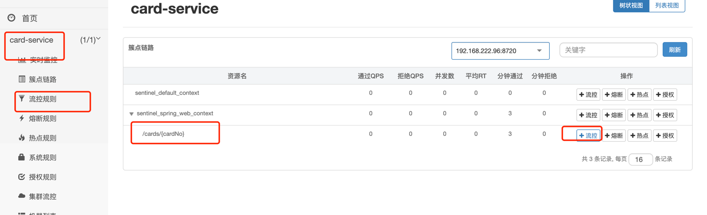
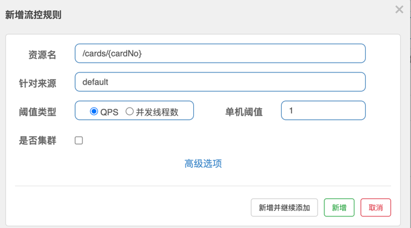
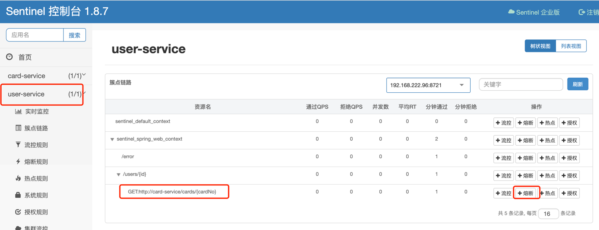
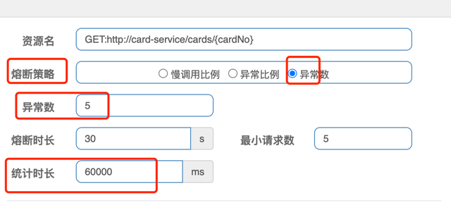

## 01-服务限流
### 01-01概念

#### 什么是服务限流

因为软件系统的处理能力是有限的，限流限制到达系统的并发请求数量，保证系统能够正常响应部分用户请求，而对于超过限制的流量，则通过拒绝服务的方式保证整体系统的可用性

#### Sentinel介绍

Sentinel是阿里开源的，面向分布式服务架构的轻量级高可用流量控制组件，目前使用比较广泛，也支持熔断功能。常常作为微服务统一的限流熔断组件。

Sentinel包括两个部分

- 客户端sdk:  Java客户端，适配springalibaba等框架
- 控制台（Dashboard）：非必需，健康情况管理、监控，独立jar包运行

#### Sentinel限流概念

- 资源: 资源是 Sentinel 的关键概念。它可以是 Java 应用程序中的任何内容，例如，由应用程序提供的服务，或由应用程序调用的其它应用提供的服务，甚至可以是一段代码。资源是Sentinel进行限流保护的基本单位

- 规则：围绕资源的实时状态设定的规则。

  

### 01-02使用

需求：对card-service的api``http://localhost:9001/cards/10101`设置限流规则QPS=1


1. 安装dashboard，进入根目录下midware目录，运行命令`java -jar sentinel-dashboard-1.8.7.jar`，打开`http://localhost:8080/#/login`登录。 用户名密码为sentinel

2. 改造card-service，在工程的pom.xml引入依赖，pom.xml文件的dependencies标签下添加如下依赖
```
<dependency>
     <groupId>com.alibaba.cloud</groupId>
     <artifactId>spring-cloud-starter-alibaba-sentinel</artifactId>
 </dependency>
```

3. card-service配置控制台信息(注意与springcloud配置合并)
```
spring:
  cloud:
    sentinel:
      eager: true
      transport:
        port: 8719
        dashboard: localhost:8080
```
4. 启动card-service，调用api`localhost:9001/cards/10101`，因为Sentinel采用的懒加载，此时触发api才会使api登记到dashboard。可以看到该api已出现在列表中。



5. 配置流控规则，设置单机阈值为1。此时该API限流阈值为1



其他参数说明:
- 资源名：唯一名称，默认请求路径
- 针对来源：Sentinel可以针对调用者进行限流，填写微服务名，默认default（不区分来源）
- 阈值类型/单机阈值
  - QPS（每秒钟的请求数量）：当调用该api的QPS达到阈值的时候，进行限流
  - 线程数：当调用该api的线程数达到阈值的时候，进行限流。线程数限流用于保护业务线程数不被耗尽
- 流控模式：
  - 直接：api达到限流条件时，直接限流
  - 关联：当两个资源之间具有资源争抢或者依赖关系的时候，这两个资源便具有了关联。比如对数据库同一个字段的读操作和写操作存在争抢。当设置两个资源相关联时，会共同计数做限流。举例来说，`read_db` 和 `write_db` 这两个资源分别代表数据库读写，我们可以给 `read_db` 设置限流规则来达到写优先的目的
  - 链路：只记录指定链路上的流量（指定资源从入口资源进来的流量，如果达到阈值，就进行限流）【api级别的针对来源】
- 流控效果：
  - 快速失败：直接失败，抛异常
  - Warm Up：该方式主要用于系统长期处于低水位的情况下，当流量突然增加时，直接把系统拉升到高水位可能瞬间把系统压垮。通过"冷启动"，让通过的流量缓慢增加，在一定时间内逐渐增加到阈值上限，给冷系统一个预热的时间，避免冷系统被压垮的情况。


6. 验证限流。页面快速刷新`http://localhost:9001/cards/10101`，出现报错`Blocked by Sentinel (flow limiting)`


## 02-熔断

### 02-01概念

#### 什么是服务熔断

除了流量控制以外，对调用链路中不稳定的资源进行熔断降级也是保障高可用的重要措施之一。一个服务常常会调用别的模块，可能是另外的一个远程服务、数据库，或者第三方 API 等。例如，支付的时候，可能需要远程调用银联提供的 API；查询某个商品的价格，可能需要进行数据库查询。然而，这个被依赖服务的稳定性是不能保证的。如果依赖的服务出现了不稳定的情况，请求的响应时间变长，那么调用服务的方法的响应时间也会变长，线程会产生堆积，最终可能耗尽业务自身的线程池，服务本身也变得不可用。

微服务架构都是分布式的，由非常多的服务组成。不同服务之间相互调用，组成复杂的调用链路。以上的问题在链路调用中会产生放大的效果。复杂链路上的某一环不稳定，就可能会层层级联，最终导致整个链路都不可用。因此我们需要对不稳定的**弱依赖服务调用**进行熔断降级，暂时切断不稳定调用，避免局部不稳定因素导致整体的雪崩。熔断降级作为保护自身的手段，通常在客户端（调用端）进行配置

#### 和服务限流的区别

- 服务限流是在被调方，保护被调方的可用性

- 服务熔断实在调用方，保护调用方的可用性

### 02-02 使用

需求：user-service调用card-service，如果card-service api每分钟异常数超过5，则触发熔断。

1. 改造user-service，在工程的pom.xml引入依赖，pom.xml文件的dependencies标签下添加如下依赖

```
<dependency>
     <groupId>com.alibaba.cloud</groupId>
     <artifactId>spring-cloud-starter-alibaba-sentinel</artifactId>
 </dependency>
```

2. user-service配置控制台信息(注意与springcloud配置合并)

```
spring:
  cloud:
    sentinel:
      eager: true
      transport:
        port: 8719
        dashboard: localhost:8080

feign:
  sentinel:
    enabled: true   ##启用 Sentinel 与 OpenFeign 整合适配器
```

3. 创建熔断后降级处理类，在熔断后自定义返回。在user-service的controller目录下创建类CustomExceptionHandler.

   ```
   package com.demo.controller;
   
   import com.alibaba.csp.sentinel.slots.block.degrade.DegradeException;
   import org.springframework.http.HttpStatus;
   import org.springframework.web.bind.annotation.ExceptionHandler;
   import org.springframework.web.bind.annotation.RestControllerAdvice;
   
   import java.util.HashMap;
   import java.util.Map;
   
   @RestControllerAdvice
   public class CustomExceptionHandler {
       /**
        * 熔断全局异常
        */
       @ExceptionHandler(DegradeException.class)
       public Map handlerDegradeException(){
           return new HashMap(){{
               put("code", HttpStatus.TOO_MANY_REQUESTS.value());
               put("msg", "服务熔断");
           }};
       }
   }
   ```

3. 模拟card-service接口异常，修改CardController接口`@GetMapping("/cards/{cardNo}")`抛出异常

```
   @GetMapping("/cards/{cardNo}")
    public Card getCardByCardNo(@PathVariable("cardNo") Long cardNo) {
        throw new RuntimeException("模拟异常");
    }
```

5. 启动user-service与card-service，调用http://localhost:9000/users/2，可以看到打开sentinel控制台。因为Sentinel采用的懒加载，此时触发api才会使api登记到dashboard。可以看到该api已出现在列表中。



6. 打开熔断配置，对该API设置熔断规则如下。



相关参数说明如下：
- 熔断策略：
  - 慢调用比例：选择以慢调用比例作为阈值，需要设置允许的慢调用 RT（即最大的响应时间），请求的响应时间大于该值则统计为慢调用
  - 异常比例：异常比例 (`ERROR_RATIO`)：当单位统计时长（`statIntervalMs`）内请求数目大于设置的最小请求数目，并且异常的比例大于阈值，则接下来的熔断时长内请求会自动被熔断。
  - 异常数 (`ERROR_COUNT`)：当单位统计时长内的异常数目超过阈值之后会自动进行熔断。经过熔断时长后熔断器会进入探测恢复状态（HALF-OPEN 状态）。
- 熔断时长：熔断期间不调用下游
- 最小请求数：熔断策略生效的最小统计量
- 统计时长：熔断策略生效的最小统计时长

7.  验证：连续调用`http://localhost:9000/users/2`超过五次，触发熔断，返回如下

```
{"msg":"服务熔断","code":429}
```


### 02-03 基本原理

- 当在一个时间窗口内，sdk侧计数器统计如果慢调用比例/异常比例/异常数大于设定值，则触发断路器，阻止对下游的调用
- 当断路器开启一段时间（熔断时长）之后，熔断器会进入探测恢复状态（HALF-OPEN 状态），会尝试放一个请求过去
  - 如果请求成功，则假定先前导致失败的问题已被修复，并且断路器将切换到 关闭 状态（失败计数器重置）
  - 如果请求失败，则恢复到 打开 状态，并重新启动超时计时器，再给系统一段时间来从故障中恢复
  
  

## 03-微服务网关
### 03-01 概念
#### 什么是微服务网关
在微服务环境中，由于后端微服务众多，如果客户端直接访问微服务会有几个问题
1. 每个微服务地址不一样，外部访问复杂
2. 每个微服务都要重复实现鉴权以保证安全，逻辑重复
3. 容器环境下微服务地址容易变化，客户端往往不会对接注册中心，难以实时获取准确的地址

微服务网关是微服务集群中必不可少的设施之一。 微服务网关以统一的地址对外提供服务,所有的客户端都通过统一的网关访问微服务。作用包括
- 路由：将外部访问这个地址的流量，根据适当的规则路由到内部集群中正确的服务节点之上。类似功能上于传统负载均衡，相对于传统负载均衡，能够对接注册中心从而实时感知后端服务地址
- 权限控制：相对于传统负载均衡，支持编程从而实现灵活的入口权限控制
- 限流/熔断等流量安全：类似于传统负载均衡的功能，支持限流熔断等网络流量安全保护

#### 几种网关对比
从通用角度，有以下几种网关：
- 微服务网关：微服务体系下的网关，一般支持可编程，springcloud技术体系
- API网关：广义的网关，包括微服务网关，一般支持API管理，例如API开放平台

分布式体系项目有以下几种网关：
- 微服务网关：租户级网关。与开源概念一致，基于springcloudgateway，可编程，每个团队自行维护
- 分布式网关：企业级网关，平台侧统一维护，用于实现微服务与ESB间的通信
- 外联网关：租户级网关。用于实现微服务到IBM MQ等外部系统的通信

#### 微服务网关选型都有哪些
由于微服务网关要求可编程，且开发人员主要以java语言为主，因此一般基于java选型，主要有两种
- springcloudzuul：早期的springcloud体系网关，功能完善，采用同步模型性能一般，目前使用比较少
- springcloudgateway：目前主流网关选型，基于高性能的通信框架Netty，相对zuul性能更好

### 03-02 使用
#### 服务路由
需求：card-service与user-service的api通过网关对外暴露

在gateway的application.yml文件添加如下配置(直接替换)配置路由
```
server:
  port: 9002
spring:
  main:
    allow-circular-references: true
  cloud:
    gateway:
      routes:
        - id: card-service-route # 路由的id,要保证其唯一性
          uri: lb://card-service # lb 表示 从nacos 中按照名称获取微服务，并遵循负载均衡策略, card-service 即微服务注册名
          predicates:
            - Path=/cards/**  # 使用断言
          filters:
        - id: user-service-route # 路由的id,要保证其唯一性
          uri: lb://user-service # lb 表示 从nacos 中按照名称获取微服务，并遵循负载均衡策略, user-service 即微服务注册名
          predicates:
            - Path=/users/**  # 使用断言
          filters:
```
效果
1. card-service url http://localhost:9001/cards/10101 通过网关地址http://localhost:9002/cards/10101即可访问
2. user-service url localhost:9000/users/1 通过网关地址http://localhost:9002/users/1即可访问

由此实现微服务统一入口。

以上配置有两个核心概念：
- Route（路由）：网关配置的基本组成模块，和Zuul的路由配置模块类似。一个Route模块由一个ID、一个目标URI、一组断言和一组过滤器组成。如果断言为真，则路由匹配，目标URI会被访问
- Predicate（断言）：用来匹配来自HTTP请求的任何内容，例如headers或参数。接口包含多种默认方法，并将Predicate组合成复杂的逻辑（与、或、非），可以用于接口参数校验、路由转发判断等。Path断言是指通过通过请求路径来判断访问的URI是否匹配，表示如果路径满足/users/***则执行路由转发

Predicate进阶能力
1. 请求头作为匹配路由规则 Header，如果存在header头为token，值为123则执行路由

   ```
   routes:   # 配置路由，是一个集合
     - id: user-service-route          # 路由的ID, 没有固定规则但要求唯一，建议配合服务名
       uri: lb://user-service  # 匹配后提供服务的路由地址
       predicates:
         - Header=token,123
   ```

2. 查询参数作为匹配路由规则 Query，如果请求参数有skuID则执行路由

   ```
   routes:   # 配置路由，是一个集合
     - id: user-service-route          # 路由的ID, 没有固定规则但要求唯一，建议配合服务名
       uri: lb://user-service  # 匹配后提供服务的路由地址
       predicates:
         - Query=skuID
   ```

3. Host路由匹配，根 据 Host 名 进 行 匹 配 转 发，如果请求客户端Host为192.0.0.1则执行路由

```
routes:   # 配置路由，是一个集合
  - id: user-service-route          # 路由的ID, 没有固定规则但要求唯一，建议配合服务名
    uri: lb://user-service  # 匹配后提供服务的路由地址
    predicates:
      - Host=192.0.0.1
```

#### 服务过滤器

需求：实现建议鉴权，当请求头Header包含x-api-key，且值为123456时，才允许访问

在gateway服务com/demo/filter下创建自定义过滤器AuthFilter

```
package com.demo.filter;

import org.springframework.cloud.gateway.filter.GatewayFilter;
import org.springframework.cloud.gateway.filter.factory.AbstractGatewayFilterFactory;
import org.springframework.http.HttpStatus;
import org.springframework.stereotype.Component;
import org.springframework.web.server.ResponseStatusException;

@Component("authFilter")
public class AuthFilter extends AbstractGatewayFilterFactory {

    private static final String authKeyValue = "123456";

    @Override
    public GatewayFilter apply(Object config) {
        return (exchange, chain) -> {
            if (!exchange.getRequest().getQueryParams().containsKey("x-api-key")) {
                throw new ResponseStatusException(HttpStatus.UNAUTHORIZED, "不允许访问");
            }
            String authKey = exchange.getRequest().getQueryParams().get("x-api-key").get(0);
            if (!authKey.equals(authKeyValue)) {
                throw new ResponseStatusException(HttpStatus.UNAUTHORIZED, "不允许访问");
            }
            return chain.filter(exchange);
        };
    }
}
```

在gateway的application.yml文件添加如下配置，修改user-service-route路由

```
... 上述省略
        - id: user-service-route # 路由的id,要保证其唯一性
          uri: lb://user-service # lb 表示 从nacos 中按照名称获取微服务，并遵循负载均衡策略, user-service 即微服务注册名
          predicates:
            - Path=/users/**  # 使用断言
          ### 增加上述filter
          filters:
            - AuthFilter
```

测试验证

- 携带正确的x-apikey调用，http://localhost:9002/users/1?x-api-key=123456 调用成功
- 携带错误的x-apikey调用，http://localhost:9002/users/1?x-api-key=12345 调用被拦截

### 03-03 基本原理

`SpringCloudGateway`核心设计基于`路由Route`，每个`Route`含有多个`断言Predicate`和`过滤器filter`，当请求满足`路由Route`的所有`断言Predicate`时，请求会被当前`路由Route`接受，之后`路由Route`含有的`过滤器filter`会处理请求，所有的核心逻辑处理都在`过滤器Filter`中
