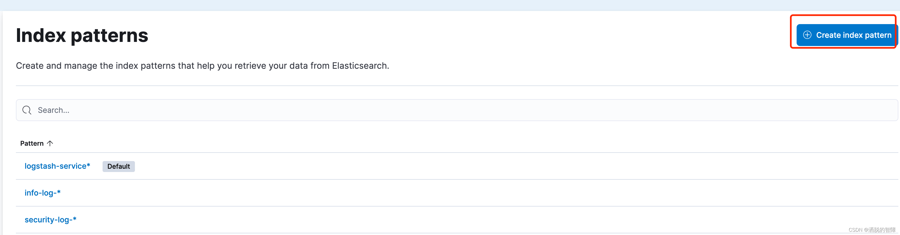
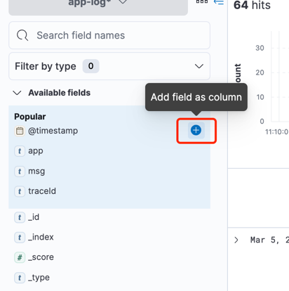
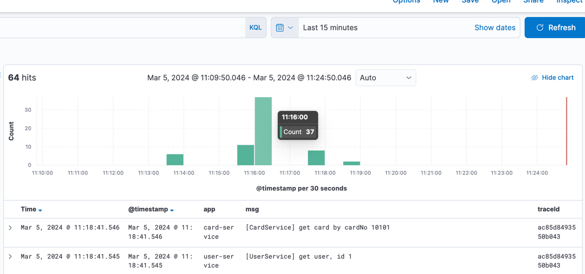
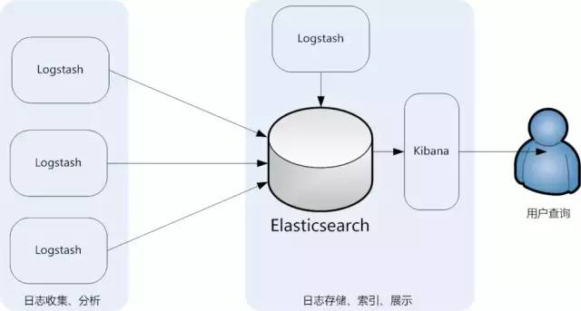
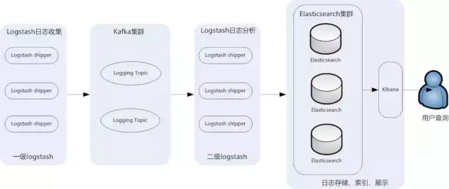
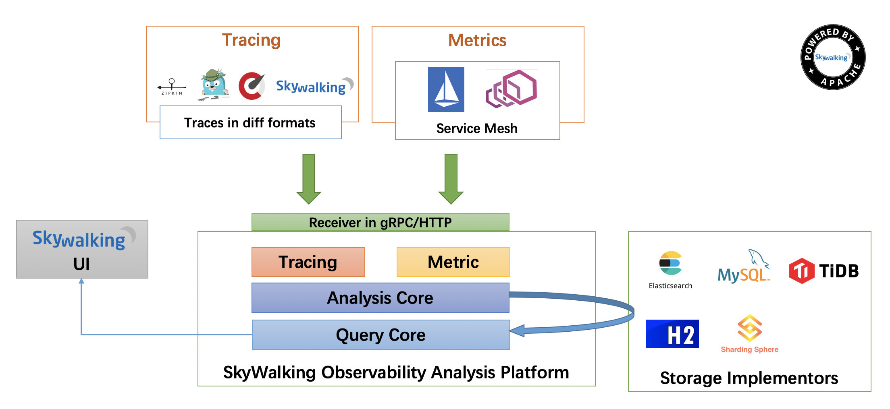
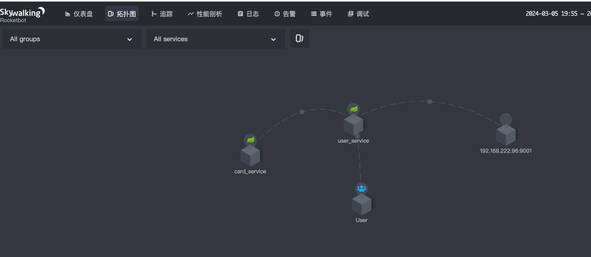
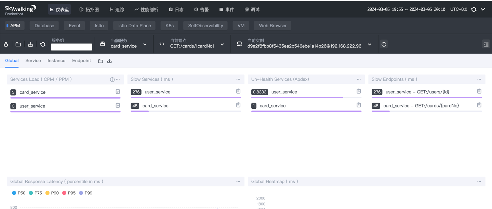
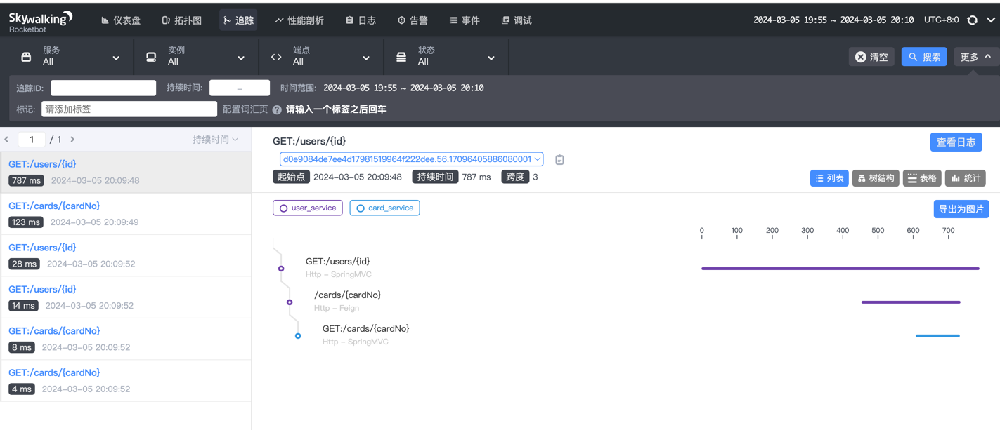

## 00-服务监控概述

### 基本概念

微服务中追踪和度量必要性和复杂程度比单体系统时要更高，完整的可观测能力是运行分布式系统的前提与必要条件。分布式监控主要包括三大部分：

- 追踪：微服务时代，一个外部请求需要内部若干服务的联动响应，追踪将整个请求在不同应用和系统中的操作信息串联起来，用于排障以及性能分析
- 日志：日志的职责是记录离散事件，通过这些记录事后分析出程序的行为。分布式系统下应用分散，日志需要进行统一采集以提升分析的效率
- 度量：用来计算 Events 发生数量的数据集，包括请求量、平均响应时间、错误率等，可作为告警系统的输入

在分布式系统下，对应主要用到的组件包括

- 日志中心：将所有日志聚合起来进行存储、查询
- 应用性能监控：聚焦应用性能监控（Application Performance Monitor)，展示链路拓扑、应用性能情况等
- 服务追踪：基于opentracing规范，定义了请求链路如何串联的规范，日志与监控组件都实现了该规范。

## 01-服务日志中心

### 01-01 概述

#### 什么是服务日志中心

日志中心用于大规模服务的日志集中管理查看，极大的为微服务开发人员提供了排查生产环境的便利。

举个例子，例如每个服务生产上就两台Tomcat，查日志上服务器上挨个查。如果发现不在这台机器上，就去另一台机器上查日志。

但是在分布式环境，这种方法效率太低，面临问题包括日志量太大如何归档、文本搜索太慢怎么办、如何多维度查询。因此需要集中化的日志管理，将所有服务器上的日志收集汇总，以提高定位问题的效率。

#### 服务日志中心技术选型ELK

ELK是ElasticSearch+LogStash+Kibana三个组件的缩写，是现代微服务架构流行的分布式日志解决方案。ELK三个组件的功能概述为

- **Logstash**：用来负责搜集、分析、过滤日志的工具，并且负责将收到的各节点日志一并发往elasticsearch上去
- **ElasticSearch**：负责存储最终数据、建立索引和对外提供搜索日志的功能。ES是开源分布式全文搜索引擎，提供搜集、分析、存储数据三大功能
- **Kibana**：前端日志展示框架，它可以非常详细的将日志转化为各种图表。

一般采集端往往会部署filebeat用于高效率的日志采集。


#### ES 基本了解

ES是一个全文检索数据库，有几个核心概念

- Index：等同于关系型数据库的表
- Document：文档，等同于关系型数据库的行，只接受Json格式
- 列：文档字段，等同于关系型数据库的表的列名

ES集群由一个或多个Elasticsearch节点组成，是一个一主多从架构

- Master主节点: 集群唯一，可选举。主节点负责创建索引、删除索引、跟踪哪些节点是集群的一部分，并决定哪些分片分配给相关的节点、追踪集群中节点的状态等，master节点无需参与文档层面的变更和搜索。
- DataNode数据节点：负责数据的存储和相关的操作

ES适用的场景

- 搜索引擎：全局检索能力支持其他数据库所不具备的搜索能，因此适合与日志场景，日志搜索大多是没有明确信息的，需要模糊搜索从 PB 级的数据中毫秒级返回搜索结果。
- 数据库查询加速: 关系型数据库更偏向事务型查询，在海量数据规模的场景下，容易遇到查询性能不足、可扩展性差的挑战。ES 提供了弹性扩展及海量数据下的高并发低延时查询能力，通过数据同步工具保持与数据库同步，并支持 SQL 能力，满足数据库加速查询的需求，弥补了传统数据库的不足

### 01-02 使用

需求：对于API localhost:9000/users/1，当前在user-service与card-service分别打印了日志

```
user-service:  logger.info("[UserService] get user, id {}", id);
card-service:  logger.info("[CardService] get card by cardNo {}", cardNo);
```

#### 搭建ELK
由于logstash非常耗费资源(至少2c2g 40g磁盘)，且实际logstash承担的格式转换工作不是必须的，因此此处跳过logstash安装，应用直接投递日志到es中。
如果本地docker安装有问题，可使用现成的环境跳过该步，现成环境如下：

- ES地址：http://47.108.84.228:9200/_cat/nodes?v
- Kibana地址：http://47.108.84.228:5601/app/discover#/

以下为docker安装ELK步骤。进入midware目录，使用docker安装步骤如下

```
docker network create elk
docker run -p 9200:9200 -p 9300:9300 -e "discovery.type=single-node" -e "ES_JAVA_OPTS=-Xms256m -Xmx256m" --name elasticsearch --network elk -d elasticsearch:7.14.2
docker run -p 5601:5601 -e "ELASTICSEARCH_HOSTS=http://elasticsearch:9200" --name kibana --network elk -d kibana:7.14.2
```

也可以使用docker-compose一键安装，运行如下命令

```
docker-compose -f docker-compose-elk.yaml up -d
```

#### Spring应用日志集成ELK

1. 集成日志投递es组件、logstash-logback-encoder以及sleuth依赖，其中logstash-logback-encoder负责与日志与logstash的集成，sleuth负责实现链路追踪。改造card-service与user-service，在工程的pom.xml分别引入依赖，pom.xml文件的dependencies标签下添加如下依赖。

   ```
      <dependency>
          <groupId>com.internetitem</groupId>
          <artifactId>logback-elasticsearch-appender</artifactId>
          <version>1.6</version>
      </dependency>
     <dependency>
         <groupId>org.springframework.cloud</groupId>
         <artifactId>spring-cloud-starter-sleuth</artifactId>
     </dependency>
   ```

2. 应用配置日志，改造card-service与user-service，在工程的/src/main/resources下创建logback-spring.xml文件，配置log格式并发送至es。以下配置destination表示es地址，这里使用云上的地址。日志格式采用json格式，包含traceId，traceId为一次API请求生产的唯一标识，用于串联请求。

```
<?xml version="1.0" encoding="UTF-8"?>
<configuration>
    <include resource="org/springframework/boot/logging/logback/base.xml"/>
    <springProperty scope="context" name="applicationName" source="spring.application.name"/>

    <appender name="loguploader" class="com.internetitem.logback.elasticsearch.ElasticsearchAppender">
        <url>http://47.108.84.228:9200/_bulk</url>
        <index>app-log</index>
        <connectTimeout>10000</connectTimeout>
        <readTimeout>10000</readTimeout>
        <headers>
            <header>
                <name>Content-Type</name>
                <value>application/json</value>
            </header>
        </headers>
        <properties>
            <property>
                <name>app</name>
                <value>${applicationName:-}</value>
            </property>
            <property>
                <name>level</name>
                <value>%level</value>
            </property>
            <property>
                <name>traceId</name>
                <value>%X{traceId:-}</value>
            </property>
            <property>
                <name>spanId</name>
                <value>%X{spanId:-}</value>
            </property>
            <property>
                <name>msg</name>
                <value>%message</value>
            </property>
            <property>
                <name>timestamp</name>
                <value>%date{\"ISO8601\"}</value>
            </property>
        </properties>
    </appender>

    <root level="INFO">
        <appender-ref ref="loguploader"/>
    </root>
</configuration>
```

3. 配置kibana查看日志，打开地址http://47.108.84.228:5601/app/management/kibana/indexPatterns，选择右上角Create index pattern创建索引模式



4. 输入索引名称，app-log-*，之后完成创建索引

5. 转到http://47.108.84.228:5601/app/discover查询日志。右侧选择关键字段展示，筛选如下，依次点击Add Filed as Column


6. 本地发起请求http://localhost:9000/users/1, 之后在平台上查询日志如下。可见同一个请求的traceId一致。




### 01-03 ELK优化方案
此架构的缺点是Logstash消耗系统资源比较大，运行时占用CPU和内存资源较高，性能也比较差，日志流量大的时候logstash容易出问题导致丢数据


引入了消息队列kafka做流量削峰，保证logstash承接的流量不会太大，并且基于kafka的可靠性提升数据存储的可靠性

## 02-应用性能监控

### 02-01 概述

#### 什么是应用性能监控APM

应用程序性能监控（APM）是使用软件工具来监控关键业务应用程序性能的过程，主要监控以下几类指标

- CPU利用率
- 响应时间
- 错误率
- 请求流量
- 服务拓扑

#### APM选型都有哪些

APM有大量商用产品，可支持前端(APP/浏览器)到后端整体监控，也有开源产品，主要以后端为主

- Skywalking：最主流的选型，支持语言比较多，Java，.NET Core 和 Node.JS
- PinPoint APM: 主要针对java的监控工具

#### Skywalking介绍


- 上部分 Agent ：负责从应用中，收集链路信息，发送给 SkyWalking OAP 服务器
- 下部分 SkyWalking OAP：负责接收 Agent 发送的 Tracing 数据信息，然后进行分析(Analysis Core) ，存储到外部存储器( Storage )，最终提供查询( Query )功能
- 右部分 Storage ：Tracing 数据存储。目前支持 ES、MySQL、Sharding Sphere、TiDB、H2 多种存储器。
- 左部分 SkyWalking UI ：负责提供控台，查看链路等等。

### 02-02 使用

需求：user-service与card-service集成sky walking监控

#### 搭建Skywalking

如果本地docker安装有问题，可使用现成的环境跳过该步，现成环境如下：

- skwakling oap: 47.108.84.228:11800
- Skywalking ui: 47.108.84.228:8088

安装组件包括SkyWalking OAP、SkyWalking UI。存储使用复用日志中心数据库ES，docker安装命令如下

```
docker run --name oap -d -p 12800:12800 -p 11800:11800 --link elasticsearch:elasticsearch -e SW_STORAGE=elasticsearch -e SW_STORAGE_ES_CLUSTER_NODES=elasticsearch:9200 -e TZ=Asia/Shanghai -e JAVA_OPTS="-Xms128m -Xmx128m" --network elk apache/skywalking-oap-server:8.9.0
docker run -d --name skywalking-ui -p 8088:8080  -e TZ=Asia/Shanghai -e SW_OAP_ADDRESS=http://47.108.84.228:12800 -e JAVA_OPTS="-Xms128m -Xmx128m" apache/skywalking-ui:8.9.0
```

#### Spring应用集成Skywalking

1. 下载agent，打开https://archive.apache.org/dist/skywalking/java-agent/8.9.0/apache-skywalking-java-agent-8.9.0.tgz，解压到项目目录midware下。(该步已执行过)
2. 因为SkyWalking使用agent字节码注入模式，因此无需注入依赖，需要在服务启动时引入。在项目根目录以如下方式启动card-service与user-service

```
java -jar -javaagent:midware/skywalking-agent/skywalking-agent.jar -Dskywalking.agent.service_name=card_service -Dskywalking.collector.backend_service=47.108.84.228:11800 card-service/target/card-service-0.0.1-SNAPSHOT.jar
java -jar -javaagent:midware/skywalking-agent/skywalking-agent.jar -Dskywalking.agent.service_name=user_service -Dskywalking.collector.backend_service=47.108.84.228:11800 user-service/target/user-service-0.0.1-SNAPSHOT.jar
```

3. 触发user-service调用`http://localhost:9000/users/1`
4. 查看拓扑图，可以看到服务链路的展示


5. 查看仪表盘，可以看到服务性能情况


6. 打开链路，可以看到每一次请求各部分的耗时
